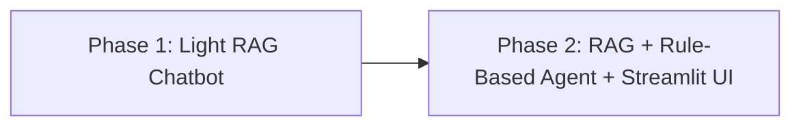

# 🏡 HomeSecure Chatbot – RAG + Rule-Based Agent System 🧠⚙️

A fully local, offline chatbot system combining **Retrieval-Augmented Generation (RAG)**, a **rule-based Agent architecture**, and a **Streamlit web interface**.  
Uses a static `.txt` knowledge base, vector search with FAISS, and a locally hosted **Mistral 7B** model for generation — **no cloud, no APIs, no internet required**.

---

## 🆕 New in v2.0

- Added **web UI** using Streamlit
- Real-time **chat history** display
- Retrieved **context visibility**
- Agent **tool responses** and fallback to Mistral generation

---

## 📌 Project Phases Overview


---

### 📁 Project Structure ###

```
HomeSecure-Chatbot-Lightweight-RAG-System/
├── agents/
│   ├── agent.py
│   └── tools.py
├── embeddings.py
├── retrieval.py
├── run_rag_cli.py
├── streamlit_app.py
├── knowledge_base/
├── environment.yml
├── requirements.txt
├── screenshots/
│   ├── screenshot_1_chat.png
│   ├── screenshot_2_agent_response.png
├── README.md
├── LICENSE

```
---

## ✨ Features by Phase
### 📦 Phase 1: Light RAG Chatbot
- 🔍 Context retrieval using FAISS

- 🧠 Prompt generation with Mistral 7B

- 📚 .txt-based knowledge base

- 🖥️ CLI interaction

### 🤖 Phase 2: Rule-Based Agent + Streamlit UI
- 📊 Intent detection (book, price, complaint, etc.)

  #### 🛠 Tool execution:

- book_inspection()

- show_pricing()

- escalate_to_human()

  #### 🛡 Guardrails:

- Topic relevance

- Missing field detection

- Off-topic blocking

- Fallback to Mistral generation

- Streamlit web app interface

---


## 🧠 Tech Stack

| Component      | Tool/Library |
|----------------|--------------|
| Language Model | Mistral 7B via HuggingFace Transformers |
| Embeddings     | all-MiniLM-L6-v2 from `sentence-transformers` |
| Vector Search  | FAISS (in-memory flat index) |
| Agent Layer    | Custom Python class (rule-based logic) |
| Web Inference  | Streamlit |
| Runtime        | Conda + Python 3.10 |
| Inference Engine | PyTorch + Accelerate |


---

### 🔁 How the Agent Pipeline Works ###

```
User Question
      ↓
Retrieve Context (FAISS)
      ↓
Agent Layer:
   • Analyze Intent
   • Apply Guardrails
   • Call Tool or fallback to RAG
      ↓
Final Answer (Tool response or Mistral generation)


```


---


## 🖥️ Running the Streamlit App
```bash
# 1. Clone the project
git clone https://github.com/Umer-Mahmood-Khan/HomeSecure-Chatbot-Lightweight-RAG-System.git
cd HomeSecure-Chatbot-Lightweight-RAG-System

# 2. Create environment
conda env create -f environment.yml
conda activate homesecure_env

# 3. Run the Streamlit app
streamlit run streamlit_app.py --server.address=0.0.0.0 --server.port=8501

```

---


## 🖼️ Screenshots

### 🔹 Chat Interface

### 🔹 Agent Response Example

